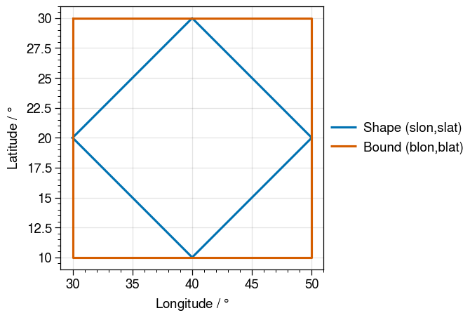

# Reading in Defined GeoRegion Information

In this section, we go through process of extracting information regarding a GeoRegion.

## Extracting GeoRegion Information

We use the function `GeoRegion(ID)`, where `ID` is the ID of the GeoRegion, in order to extract the information for the GeoRegion.

```@repl
using GeoRegions
GeoRegion("AR6_NWN")
```

```@docs
GeoRegion(::AbstractString)
```

## The Difference between Bounds and Shape in a `PolyRegion`

What is the difference between the fields `bound` and `shape` in a `PolyRegion`?  The answer is simple: a `bound` is a rectilinear-region in the lon-lat coordinate system, while the `shape` denotes the actual `PolyRegion`.  We retrieve the longitude and latitude coordinates for the `bound` and `shape` fields using the function `coordGeoRegion()`.

!!! note "Bound and Shape in `RectRegion`"
    There is no field `shape` in a `RectRegion` because the `shape` of a `RectRegion` is defined by its rectilinear bound.

```@repl
using GeoRegions
blon,blat,slon,slat = coordGeoRegion(GeoRegion("AR6_NWN"))
```

From plotting the bounds (blon,blat) and the shape(slon,slat), we see that the bound is the region defined by the westernmost, easternmost, northernmost and southernmost coordinates of the shape.



```@docs
coordGeoRegion(::RectRegion)
coordGeoRegion(::PolyRegion)
```
