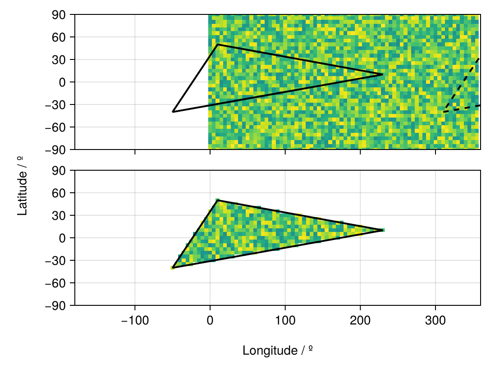
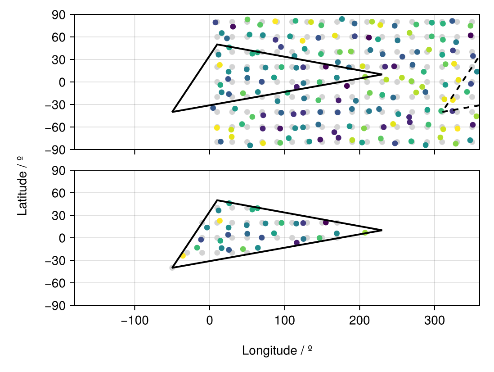

# Summary

The GeoRegions Ecosystem is a lightweight ecosystem of three Julia libraries that aids in the analysis and extraction of gridded data in Earth Observation. They are:

  * GeoRegions.jl: Defining geographic regions of interest
  * RegionGrids.jl: Extracting gridded data for geographic regions of interest
  * LandSea.jl: Defining Land-Sea masks for various datasets

The goal of the GeoRegions ecosystem is to simplify data extraction, and the basic steps are as follows:

  1. Obtain gridded/raster data, with the longitude/latitude grids
  2. Define a geographic region (GeoRegion) of interest using GeoRegions.jl, with 
  3. Perform data extraction for the GeoRegion using RegionGrids.jl

This package was inspired by the python package [regionmask](https://github.com/regionmask/regionmask) [@mathias_hauser_2024_10849860] and is possibly its closest equivalent in the Julia programming language.

# Statement of need

While other packages exist in the JuliaGeo ecosystem (e.g., Rasters.jl) that are useful and arguably more comprehensive for the extraction of raster (i.e., gridded) data, these packages and ecosystems are built as wrappers around reading data files directly (e.g., NetCDF, GeoTiff, GRIB), and reading data into GeoInterface.jl compatible objects and tables. However, in recognition of the fact that not everyone wishes to use the GeoInterface, the GeoRegions ecosystem is deliberately kept simple and relatively low-level, so that users who are starting out with Julia can easily input a large data array and get back a simple data array without needing to understand GeoInterface types and data structures. This allows not only for easy loading and extraction of data in a region of interest, but also for the easy saving of this data.

Next, the GeoRegions ecosystem is based upon shapes and polygons operations for data extraction, whereas Rasters.jl more intuitively depends upon the specification of rectilinear ranges in the longitude and latitude dimensions. While this works for standard gridded geospatial and top-level climate observational datasets such as the Level 3 GPM IMERG products [@huffman2015nasa], or output from simple climate models such as SpeedyWeather.jl [@klower2024speedyweather], in cases where the grid is not rectilinear in the longitude-latitude direction or even unstructured, as is commonly the case with large climate models, this can be a problem.

However, the GeoRegions Ecosystem, via RegionGrids.jl, is also able to more easily support (1) grids that are not rectilinear in the longitude/latitude coordinates, as is common in native output from weather and climate models (e.g., WRF [@skamarock2019description]), and even (2) unstructured mesh-grids such as the cubed-sphere mesh (e.g., CESM2 [@danabasoglu2020community]). See the example below on a set of perturbed longitude/latitude points.

Lastly, the GeoRegions Ecosystem (through GeoRegions.jl) also has predefined scientific regions of interest, similar to and inspired by [regionmask](https://regionmask.readthedocs.io/en/stable/defined_scientific.html). These are:

1. The regions from @giorgi2000uncertainties
2. SREX (Special Report on Managing the Risks of Extreme Events and Disasters to Advance Climate Change Adaptation) regions from @seneviratne2012changes
3. IPCC AR6 regions [@essd-12-2959-2020; ESSD]

# Installation

The current version of GeoRegions.jl (v8) and RegionGrids.jl (v0.1) currently supports Julia 1.10 and later, and can be installed with the Julia package manager using the following Julia commands:

```@julia
using Pkg
Pkg.add("GeoRegions")
```

This will automatically install all dependencies of GeoRegions.jl, which include:
* Distances.jl - Calculation of haversine (great-circle) distance between two (lon,lat) points
* GeometryBasics.jl - Defines geometries (e.g., polygons) based on given shapes that are compatible with the JuliaGeometry ecosystem
* GeometryOps.jl - For basic polygonal operations (e.g., is a point in a polygon)
* Glob.jl - Finds and lists JSON files that contain GeoRegion information
* JSON3.jl - Save necessary information on shapes into JSON-readable text files, and load them
* PrettyTables.jl - For neatly displaying the available GeoRegions in tabular format

You can also do the same for RegionGrids.jl and LandSea.jl

```@julia
using Pkg
Pkg.add("RegionGrids")
Pkg.add("LandSea")
```

RegionGrids.jl requires GeoRegions.jl as a dependency, so all dependencies of GeoRegions.jl will be installed with the above command. LandSea.jl does not have any dependencies besides the base Julia environment.

# Sample Code for Region Definition and Data Extraction

In practice, this would look like the following:

```@julia
using GeoRegions
using RegionGrids

# 1. Get gridded data, and longitude/latitude

data = ...
dlon = ... # longitudes for gridded data points
dlat = ... # latitudes for gridded data points

# 2. Define a Geographic Region using a shape defined by vectors for longitude and latitude respectively

geo = GeoRegion(lon,lat)

# 3. Create a RegionGrid for data extraction using the GeoRegion, and longitude and latitude vectors

ggrd = RegionGrid(geo,dlon,dlat)

# 4. Extract the data within the GeoRegion of interest

longitude and latitude vectors respectively
ndata  = extract(data,ggrd)
newlon = ggrd.lon
newlat = ggrd.lat
```

# Example Use-Case: Standard Rectilinear Data

The following is an example:

```@julia
using GeoRegions
using RegionGrids
using CairoMakie

# 1. Create gridded data, and longitude/latitude

lon = collect(0:5:359);  nlon = length(lon)
lat = collect(-90:5:90); nlat = length(lat)
data = rand(nlon,nlat)

# 2. Define a Geographic Region using a shape defined by vectors for longitude and latitude respectively

geo = GeoRegion([10,230,-50,10],[50,10,-40,50])
slon,slat = coordinates(geo) # extract the coordinates

# 3. Create a RegionGrid for data extraction using the GeoRegion, and longitude and latitude vectors

ggrd = RegionGrid(geo,lon,lat)

# 4. Extract the data within the GeoRegion of interest

ndata = extract(data,ggrd)

# 5. Plot the data using CairoMakie
fig = Figure()

ax1 = Axis(
    fig[1,1],width=450,height=150,
    limits=(-180,360,-90,90)
)
heatmap!(ax1,lon,lat,data,colorrange=(-1,1))
lines!(ax1,slon,slat,color=:black,linewidth=2)
lines!(ax1,slon.+360,slat,color=:black,linewidth=2,linestyle=:dash)

hidexdecorations!(ax1,ticks=false,grid=false)

ax2 = Axis(
    fig[2,1],width=450,height=150,
    limits=(-180,360,-90,90)
)
heatmap!(ax2,ggrd.lon,ggrd.lat,ndata,colorrange=(-1,1))
lines!(ax2,slon,slat,color=:black,linewidth=2)

Label(fig[3,:],"Longitude / º")
Label(fig[:,0],"Latitude / º",rotation=pi/2)

resize_to_layout!(fig)
fig
```

You should get something akin to the figure diplayed below. Note that while the initial data here is given in the 0-360ºE grid, the GeoRegion given is not. We see that RegionGrids.jl is still able to find the data points in the dashed boundaries and concatenate them with the data in the solid line, to produce the final dataset below without needing the user to perform additional merging steps.



# Example Use-Case: Data on Perturbed Lon/Lat Grid

The following is an example:

```@julia
using GeoRegions
using RegionGrids
using CairoMakie

# 1. Create gridded data, and longitude/latitude

lon = collect(10:20:360); nlon = length(lon)
lat = collect(-80:20:90); nlat = length(lat)
data = rand(nlon,nlat)[:]

# 2. Create grid of longitude/latitude points and perturb
glon = zeros(nlon,nlat); glon .= lon;  glon = glon[:]
glat = zeros(nlon,nlat); glat .= lat'; glat = glat[:]

plon = glon .+ 14rand(nlon*nlat) .- 7
plat = glat .+ 14rand(nlon*nlat) .- 7

# 2. Define a Geographic Region using a shape defined by vectors for longitude and latitude respectively

geo = GeoRegion([10,230,-50,10],[50,10,-40,50])
slon,slat = coordinates(geo) # extract the coordinates

# 3. Create a RegionGrid for data extraction using the GeoRegion, and longitude and latitude vectors

iggrd = RegionGrid(geo,Point2.(glon,glat))
pggrd = RegionGrid(geo,Point2.(plon,plat))

# 4. Extract the data within the GeoRegion of interest

ndata = extract(data,iggrd)
pdata = extract(data[:],pggrd)

# 5. Plot the data using CairoMakie
fig = Figure()

ax1 = Axis(
    fig[1,1],width=450,height=150,
    limits=(-180,360,-90,90)
)
scatter!(ax1,glon,glat,color=:lightgrey)
scatter!(ax1,plon,plat,color=data)
lines!(ax1,slon,slat,color=:black,linewidth=2)
lines!(ax1,slon.+360,slat,color=:black,linewidth=2,linestyle=:dash)

hidexdecorations!(ax1,ticks=false,grid=false)

ax2 = Axis(
    fig[2,1],width=450,height=150,
    limits=(-180,360,-90,90)
)
scatter!(ax2,iggrd.lon,iggrd.lat,color=:lightgrey)
scatter!(ax2,pggrd.lon,pggrd.lat,color=pdata)
lines!(ax2,slon,slat,color=:black,linewidth=2)

Label(fig[3,:],"Longitude / º")
Label(fig[:,0],"Latitude / º",rotation=pi/2)

resize_to_layout!(fig)
fig
```



And we see that there are points in the original grid (grey) that are in the defined GeoRegion, but the perturbed points (colored points) are not. And vice versa.

# Acknowledgements

The author acknowledges contributions from Alexander Barth (@Alexander-Barth). The author also would like to thank Anshul Singhvi (@asinghvi17) for help on the implementation of GeometryOps.jl into the GeoRegions ecosystem to replace PolygonOps.jl.

# References